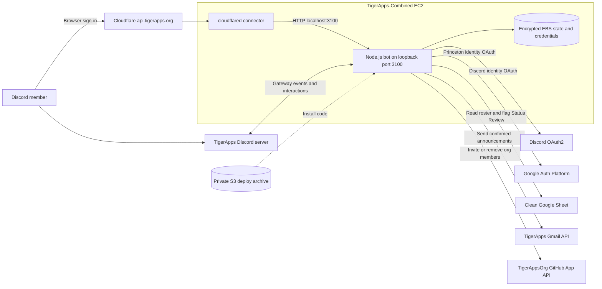
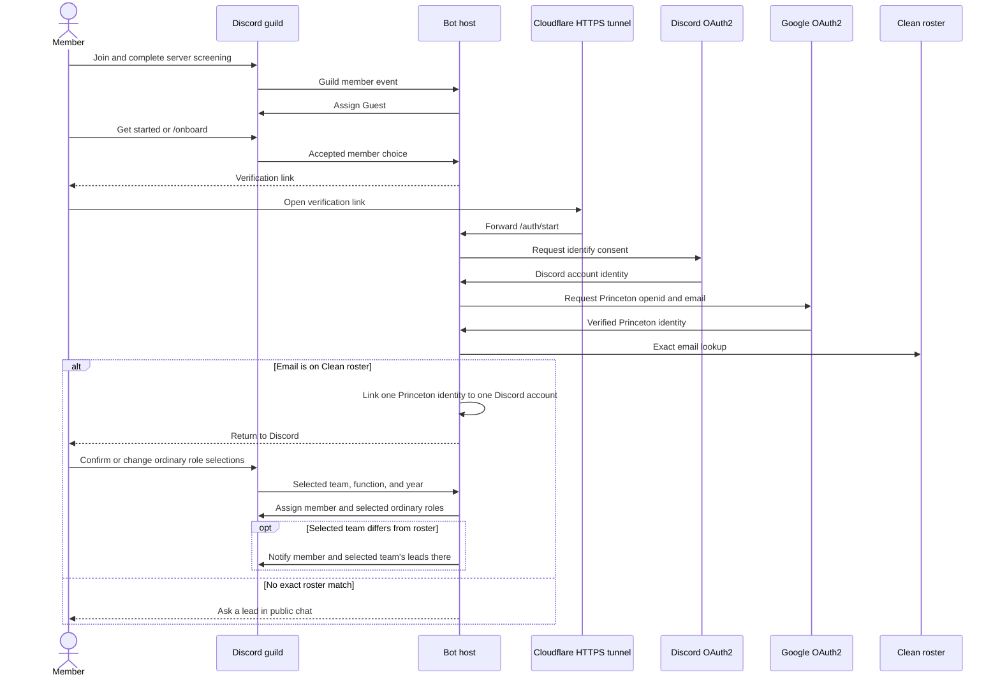
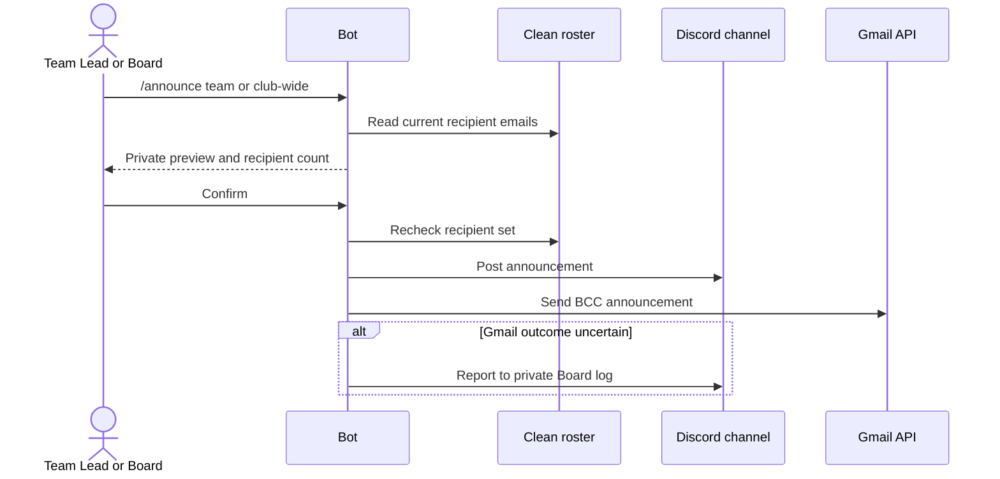

# TigerApps Discord bot architecture

The bot runs as one Node.js service on the `TigerApps-Combined` EC2 instance. Cloudflare serves `api.tigerapps.org` over HTTPS and forwards member sign-in callbacks through the `tigerapps-discord-bot` tunnel to port 3100 on that instance. The Discord connection uses Gateway, so the host does not need a public Discord interaction endpoint.

## Hosting and services

| Part | Location | Purpose |
| --- | --- | --- |
| Discord application and guild | Discord | Gateway events, slash commands, roles, channels |
| `api.tigerapps.org` | Cloudflare DNS and edge | Public HTTPS origin for member OAuth |
| `tigerapps-discord-bot` tunnel | Cloudflare plus `cloudflared` on EC2 | Forward HTTPS to `http://localhost:3100` |
| Node.js bot and OAuth listener | `TigerApps-Combined` EC2, loopback port 3100 | Discord Gateway connection, callbacks, command handling |
| Bot code | `/opt/tigerapps-discord-bot` on EC2 | Installed application and dependencies |
| `.env`, `server.json`, `data/state.json` | Encrypted EBS volume at `/var/lib/tigerapps-discord-bot` | Credentials, Discord ID map, account links and action state |
| Deployment archives | Private, encrypted `tigerapps-discord-bot-deploy-104733724423-us-east-1` S3 bucket | Commit-specific code archives for host updates |
| Clean roster workbook | Google Sheets | Member allowlist and `Status Review` flag |
| Google OAuth clients | Google Auth Platform | Princeton member sign-in and TigerApps mailbox authorization |
| TigerApps mailbox | Gmail | `/announce` email delivery |
| GitHub App | TigerAppsOrg | Organization invitations and removals |

## Component view

Discord interactions arrive through the Gateway connection, so there is no Discord Interactions Endpoint URL. The GitHub App makes outbound API calls on commands and does not subscribe to webhooks, so its webhook can be inactive. The HTTP listener exposes only `/auth/*` callbacks and `/health`; `/health` returns 200 only when the Discord client is ready.

Two systemd units keep the bot and tunnel running after reboot: [`tigerapps-discord-bot.service`](../deploy/tigerapps-discord-bot.service) and [`tigerapps-discord-tunnel.service`](../deploy/tigerapps-discord-tunnel.service). The tunnel token and bot credentials are stored on encrypted EBS; neither is placed in a unit file or repository.

## Member onboarding

The rollout cutoff is saved at first successful startup. Existing server members may link their Princeton account, but onboarding does not change their roles until the existing-member audit. New arrivals receive Guest after screening and can use the public onboarding and help channels. The Clean roster controls whether the person is a member; the chosen ordinary team, function, and year roles determine channel access. Onboarding never grants Board or Team Lead.

Board can onboard an existing Discord member with `/onboard member email`. The bot previews an exact Clean-roster match, then links that Discord account and applies roster-based ordinary roles after Board confirms. This Board-attested link does not require the member's Google sign-in; the private Board log records who made it. Existing Board roles are left alone. If the member later verifies with Google, that identity replaces the Board-attested link for the same Discord account and email.

## Commands and data access

| Command | Actor | Effect |
| --- | --- | --- |
| `/onboard` | Any member; Board with `member` and `email` | Self-service sign-in, or Board-confirmed roster linking and ordinary role assignment for another Discord member |
| `/info` | Board or Team Lead | Private response with one Clean-roster person's name, team, role, year, GitHub, email, and phone |
| `/announce` | Board club-wide or for any team; leads for mapped teams | Preview, then post to Discord and send roster email through Gmail with hidden recipients |
| `/github-invite` | Board or Team Lead | Invite an exact Clean-roster member by GitHub username or Princeton email; acceptance remains pending |
| `/resign` | Linked non-Board member | Move controllable Discord roles to Alumni, flag Status Review, notify Board; GitHub remains unchanged |
| `/remove` | Board | Move target to Guest, flag Status Review, attempt GitHub org removal, notify Board of any partial failure |

The private `#bot-log` channel records every slash-command invocation and completed onboarding, including Board-assisted links and new Guest access. It also records operation failures and partial outcomes. `/info` results, announcement text, and roster phone numbers are not copied into the log.

`/announce` posts its role mention beneath the Discord message: the selected team's role for team announcements and the general TigerApps member role for club-wide announcements. The private preview does not ping, and email contains no Discord mention. Mail sends from `it.admin@princetonusg.com`. Team mail uses the sender's linked Princeton address as To and Reply-To and CCs the TigerApps mailbox; recipients are BCC. Club-wide Board mail uses the TigerApps mailbox as To and Reply-To. A confirmed announcement can have a partial outcome: if the Discord post succeeded but Gmail's response is uncertain, check the Sent mailbox before retrying.

## Permissions and configuration

`server.json` maps existing Discord IDs. It does not create channels or edit channel permissions. It contains the guild ID; Guest, TigerApps member, Alumni, Team Lead, and Board role IDs; onboarding, public chat, announcements, and private Board log channel IDs; team role/channel/lead mappings; ordinary function and class-year roles; and optional additional roles to revoke on resignation or removal. Team names in this map should match the Clean roster values used for preselection. Renaming a Discord role or channel preserves its ID; recreating it requires a map update.

The bot needs **Server Members Intent** and Discord permissions **Manage Roles, View Channels, Send Messages, Read Message History**. Its highest role must be below Board and above every role it manages, including Team Lead. It must be able to send in the onboarding, announcements, Board log, and mapped team channels. The announcement roles must be mentionable for the intended ping to work. It does not need Administrator, Manage Channels, Message Content Intent, or Presence Intent. Discord channel overrides must still be reviewed separately: a server-level permission alone does not guarantee access to a private channel.

The roster service account receives Editor sharing on the specific workbook so it can read Clean roster columns and check `Status Review`. The member OAuth client requests only `openid email`; the separate mailbox client requests `gmail.send`. The GitHub App needs organization **Members: read and write**, with no repository permissions beyond GitHub's implicit metadata access. A GitHub organization invitation does not become active until accepted. The current organization base repository permission is write.

## Persistence and recovery

The bot uses one process and an atomically replaced local `data/state.json` for account links, pending OAuth attempts, action confirmations, the onboarding panel ID, and the rollout cutoff. Running multiple replicas against this file is unsupported. The state and credentials live on a dedicated encrypted EBS volume. Back up and transfer the state file before moving hosts; losing it breaks existing account links and changes how the first-rollout cutoff is interpreted. Keep `.env`, `server.json`, the state file, service-account JSON, Gmail refresh token, GitHub private key, and Cloudflare connector credentials out of Git and out of this document.

Startup validates mapped Discord roles, channels, hierarchy, and send permissions before registering commands or posting the onboarding panel. A failed validation should be fixed at the source mapping or Discord permission, then the process restarted. `/remove` and `/resign` flag the roster but leave Board to update membership rows; a person still on the Clean roster can otherwise regain access by onboarding or invitation.

## Endpoints and health

Register `https://api.tigerapps.org/auth/discord` in Discord and `https://api.tigerapps.org/auth/google` in Google. The separate TigerApps mailbox authorization script uses `http://localhost:3741/callback` on the operator's computer. The bot's `/health` endpoint returns 200 when the Discord client is connected and 503 while it is starting.
